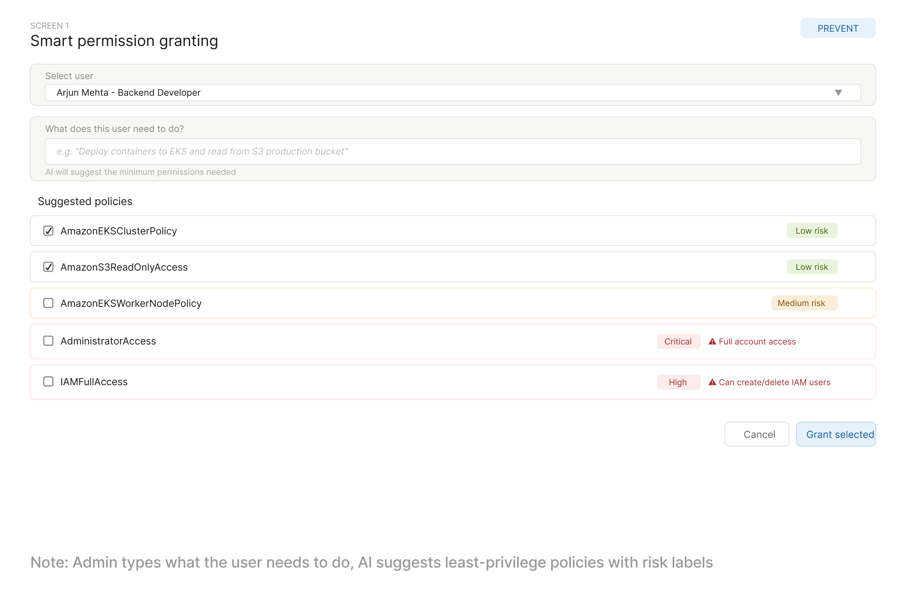
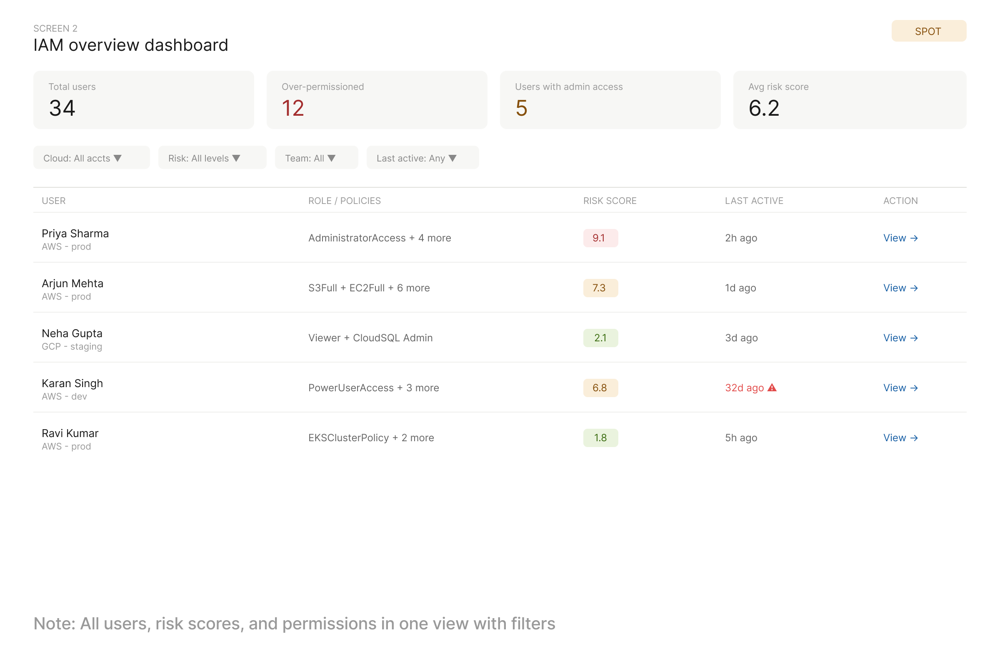
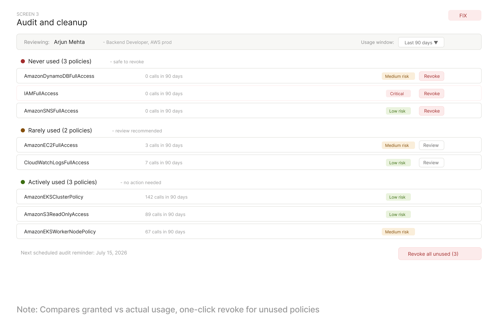

# IAM Permissions Explorer - AccuKnox PM Assignment

## Problem Statement and User Persona
See [Problem Statement and User Persona](problem-statement.md)

## Wireframes
[View in Figma](https://www.figma.com/buzz/qxk0rIjeOPfZyilBHJYbcX/Accuknox-IAM-Permissions-Explorer-Assignment?node-id=0-1&t=5AaLT6q9MQwOzCiT-1)

### Screen 1 - Smart Granting (Prevent)

### Screen 2 - IAM Overview Dashboard (Spot)

### Screen 3 - Audit and Cleanup (Fix)

## Feature Write-up
See [Feature Writeup](feature-writeup.md)

## Video Walkthrough
[Video link here](https://drive.google.com/file/d/1xmYaJHSoSUj94FAvwCXgOfGTTME_gpj7/view?usp=sharing)
